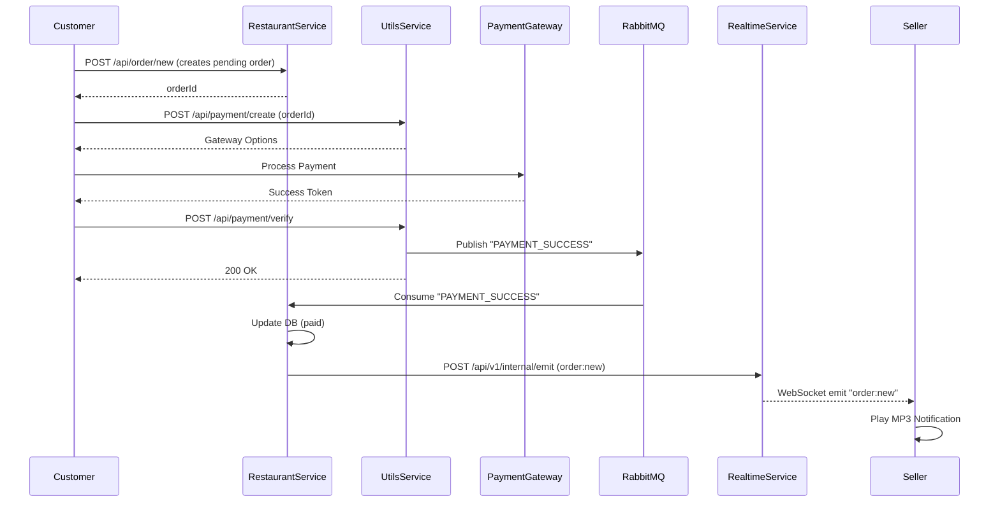
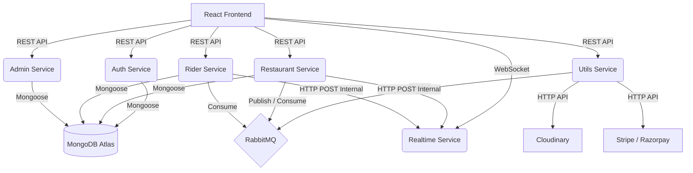
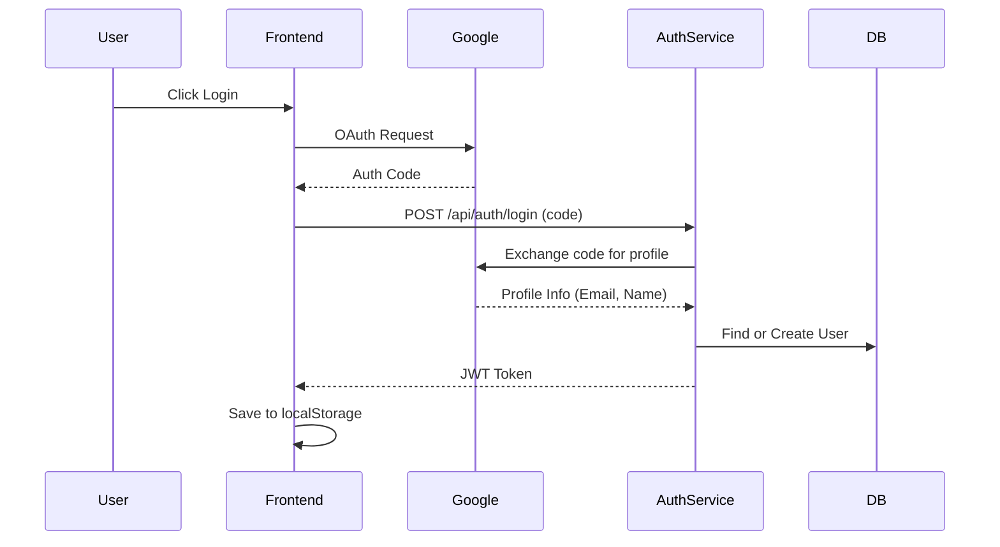
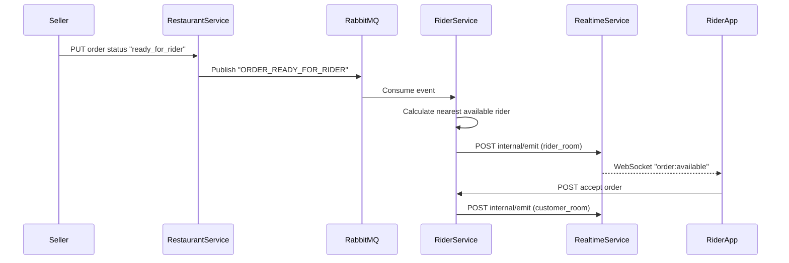

# Zomato Clone - Complete Project Bible

This document serves as the absolute source of truth for the Zomato Clone repository, designed to give complete context, architectural understanding, and implementation details for another LLM. 

---

## 1. Executive Project Overview

**Problem Solved:**
The project solves the problem of connecting customers who want to order food, restaurants (sellers) who want to sell food, and riders who want to deliver food, providing a unified real-time platform for the entire food delivery lifecycle.

**Users:**
1. **Customers:** Browse restaurants, add items to cart, place orders, make payments (Stripe/Razorpay), and track rider location in real-time.
2. **Sellers (Restaurants):** Create a restaurant profile, manage menu items, toggle availability, receive incoming orders, and update order statuses (accepted -> preparing -> ready for rider).
3. **Riders:** Register with driving license/Aadhar, toggle online/offline status, receive real-time delivery requests, accept orders, and update delivery status (reached restaurant -> marked as delivered).
4. **Admins:** View pending restaurants and riders and verify them to allow them to operate on the platform.

**Overall Business Flow:**
1. A seller creates a restaurant and adds menu items. An admin verifies the restaurant.
2. A customer selects items, adds them to the cart, and places an order via a payment gateway (Stripe/Razorpay).
3. Upon successful payment, a RabbitMQ event is published. The restaurant service consumes this and creates a paid order, triggering a WebSocket event to notify the seller.
4. The seller accepts, prepares, and marks the order as "ready for rider".
5. This publishes an event to RabbitMQ, consumed by the rider service, which finds the nearest available rider and assigns them via WebSocket.
6. The rider accepts, picks up the food, and delivers it. During transit, the rider app emits continuous location updates which are relayed to the customer's map via WebSockets.
7. Order is marked delivered.

**Overall Architecture Summary:**
The project uses a Microservices architecture on the backend, divided into 6 discrete services (`admin`, `auth`, `realtime`, `restaurant`, `rider`, `utils`). The frontend is a monolithic React SPA (Single Page Application) built with Vite and Tailwind CSS.
Services communicate synchronously via HTTP REST APIs (using internal API keys) and asynchronously via RabbitMQ (for payment successes, order readiness, etc.). Real-time communication with the frontend is handled entirely by the `realtime` service using Socket.IO.

**Complete Technology Stack:**
- **Frontend:** React 19, TypeScript, Vite, Tailwind CSS v4, React Router DOM v7, Leaflet (Maps), Socket.IO Client, Axios, React Hot Toast.
- **Backend:** Node.js (v22 target), Express 5.x, TypeScript.
- **Database:** MongoDB Atlas, Mongoose.
- **Messaging/Queue:** RabbitMQ (amqplib).
- **Authentication:** JWT (JSON Web Tokens), Google OAuth (Client-side `@react-oauth/google`).
- **External APIs:** Cloudinary (Image storage), Razorpay & Stripe (Payments), Nominatim (OpenStreetMap Reverse Geocoding), OSRM (Routing).
- **Infrastructure:** Render (Hosting - as seen from hardcoded URLs), Docker (Dockerfiles present in each service).

---

## 2. Repository Structure

The repository is structured as a monorepo containing a frontend directory and a services directory with 6 microservices.

**Structure:**
```text
/
├── frontend/               # React SPA (Customer, Seller, Rider, Admin UI)
├── services/
│   ├── admin/              # Admin verification of riders/restaurants
│   ├── auth/               # User registration, login, Google OAuth, role management
│   ├── realtime/           # Socket.IO server for notifications & live tracking
│   ├── restaurant/         # Restaurant, Menu, Cart, Order, Address management
│   ├── rider/              # Rider profile, location tracking, order assignment
│   ├── utils/              # Payment gateways (Razorpay/Stripe) & Cloudinary uploads
```

**Responsibilities & Dependencies:**
- `frontend`: Depends on all backend services via hardcoded Render URLs.
- `auth`: Independent. Generates JWTs containing user info and role.
- `restaurant`: Depends on `utils` (for image upload via HTTP) and `realtime` (for WebSocket emission via HTTP `x-internal-key`). Publishes to RabbitMQ (`order_ready_queue`), consumes from `payment_event`.
- `rider`: Depends on `utils` (image upload) and `realtime` (location emission). Publishes to RabbitMQ (none currently), consumes from `order_ready_queue`.
- `utils`: Independent. Interacts with Stripe, Razorpay, Cloudinary. Publishes payment success to `payment_event` queue.
- `admin`: Independent DB manipulation (direct DB connection to same MongoDB).
- `realtime`: Receives HTTP requests from other services (via internal key) and broadcasts WebSocket events to connected frontend clients.

---

## 3. Dependency Analysis

**Frontend Dependencies:**
- `@react-oauth/google`: Handles Google Auth flow. Used in `Login.tsx`.
- `@stripe/stripe-js`: Client-side Stripe tokenization. Used in `Checkout.tsx`.
- `axios`: Standard HTTP client for all API calls.
- `leaflet` & `react-leaflet`: Rendering interactive maps for address selection and order tracking.
- `leaflet-routing-machine`: Drawing routes between rider and delivery location.
- `socket.io-client`: Listening to real-time events (`order:new`, `rider:location`, etc.).
- `tailwindcss` & `@tailwindcss/vite`: Utility-first styling.

**Backend Dependencies (Common across services):**
- `express` (^5.2.1): The web server framework. Note that v5 handles rejected promises in async routes natively, so the custom `trycatch` middleware is somewhat redundant but still used.
- `mongoose`: ODM for MongoDB. Used to define schemas and perform CRUD.
- `jsonwebtoken`: To sign and verify user tokens.
- `cors`: To allow cross-origin requests from the frontend.
- `dotenv`: To load configuration from `.env` files.
- `amqplib`: To communicate with RabbitMQ for event-driven async flows.

**Backend Specific Dependencies:**
- `multer` (restaurant, rider): To parse `multipart/form-data` for image uploads.
- `datauri` (restaurant, rider): To convert Multer memory buffers into base64 strings so they can be sent over JSON to the utils service.
- `cloudinary` (utils): To upload images to Cloudinary CDN.
- `razorpay` & `stripe` (utils): Payment SDKs to create and verify transactions.
- `socket.io` (realtime): The WebSocket server.

---

## 4. Configuration

**package.json (Frontend):**
- Scripts: `dev` (vite), `build` (tsc -b && vite build), `lint` (eslint .), `preview` (vite preview).
- Uses `"type": "module"`.

**tsconfig.json (Frontend):**
- Splits into `tsconfig.app.json` and `tsconfig.node.json`.
- Targets `es2023`, `bundler` resolution, strict linting (`noUnusedLocals`, `exactOptionalPropertyTypes`).

**vite.config.ts (Frontend):**
- Basic Vite config with `react()` and `tailwindcss()` plugins. No proxy defined.

**package.json (Backend Services):**
- Uses `"type": "module"` (ESM).
- Scripts: `build` (tsc), `start` (node dist/index.js), `dev` (concurrently running tsc watch and node watch).
- Note: `nodemon` is NOT used; it relies on `node --watch` (available in Node 22).

**tsconfig.json (Backend Services):**
- Targets `es2020`, `moduleResolution: nodenext`, `strict: true`. Outputs to `./dist`.

**.env (Frontend):**
- Contains `VITE_STRIPE_PUBLISHABLE_KEY` and `VITE_INTERNAL_SERVICE_KEY`.
- *Security Flaw:* The internal service key is leaked to the client bundle and allows frontend clients to spoof internal service calls (e.g., faking rider locations).

**.env (Backend Services):**
- Port configurations (e.g., 5001, 5002, etc.).
- `MONGO_URI`: Hardcoded to a specific cluster. Shared across all services.
- `JWT_SEC`: Shared secret across all services to decode the JWT.
- `INTERNAL_SERVICE_KEY`: Shared secret to authenticate server-to-server HTTP calls.
- `RABBITMQ_URL`: AMQP connection string.
- `QUEUE` names: `PAYMENT_QUEUE`, `RIDER_QUEUE`, `ORDER_READY_QUEUE`.

**Dockerfiles (Backend Services):**
- Multi-stage builds.
- Stage 1: `node:22-alpine`, installs all deps, runs `npm run build`.
- Stage 2: `node:22-alpine`, installs only production deps (`npm install --only=production`), copies `dist` from stage 1, sets `CMD ["node", "dist/index.js"]`.
- The `.env` file is in `.dockerignore`, so environments must be injected at runtime.
## 5. Complete Technology Stack

**Frontend:**
- **React (v19.2.6):** Used for building the dynamic, interactive user interfaces for all 4 roles (Customer, Seller, Rider, Admin). React was chosen for its component-based architecture which makes managing complex state (like a shopping cart and real-time order tracking) easier.
- **Node (v22 target):** The backend runtime environment. Chosen for its non-blocking asynchronous nature which is perfect for I/O heavy operations like WebSocket real-time communication and database queries.
- **Express (v5.2.1):** Web framework for Node.js. Used to define RESTful API routes. Version 5 was explicitly chosen because it automatically handles rejected promises in asynchronous route handlers, eliminating the strict need for wrapping every route in `try...catch` (although a custom wrapper is still used).
- **MongoDB (Mongoose v8.24.0):** NoSQL database. Chosen for its flexibility with document schemas, specifically useful for storing nested data like geospatial coordinates (`autoLocation` in Restaurant model) and flexible cart/order structures.
- **RabbitMQ (amqplib v2.0.1):** Message broker for asynchronous inter-service communication. Chosen to decouple services; for example, the `utils` service can blindly fire a "PAYMENT_SUCCESS" event without caring if the `restaurant` service is currently up or down.
- **Docker:** Containerization tool. Used to package each microservice into a self-contained image (`node:22-alpine` multi-stage build) ensuring consistency across development and production environments.
- **JWT (jsonwebtoken v9.0.3):** Used for stateless authentication. Passed via `Authorization: Bearer <token>`. Chosen because stateless auth is required for horizontally scaling microservices.
- **REST APIs:** Used for synchronous communication (e.g. fetching restaurants, placing an order, uploading an image).
- **Socket.IO (v4.8.3):** WebSockets abstraction. Used exclusively in the `realtime` service to push live notifications to frontend clients (e.g., rider location updates, new order alerts for sellers) because REST polling would be too slow and resource-intensive.
- **Cloudinary:** Used in the `utils` service to host uploaded images (restaurant banners, menu item pictures, rider verification documents) so the local Node.js servers remain stateless and don't store files.
- **Razorpay & Stripe:** Payment gateways used to process real money transactions securely.
- **Leaflet & React-Leaflet:** Used on the frontend to render OpenStreetMap tiles and plot delivery routes (with OSRM) because it is a free, open-source alternative to Google Maps API.

---

## 6. Complete Microservice Analysis

### 6.1 `auth` Service
- **Purpose:** Handles user registration, login, and role assignment.
- **Responsibilities:** Validating Google OAuth tokens, creating user documents in MongoDB, issuing JWTs.
- **Startup flow:** Loads `.env` -> Connects to MongoDB -> Starts Express on port 5002.
- **Dependencies:** `googleapis` (to verify OAuth tokens), `jsonwebtoken`, `mongoose`.
- **APIs:** `/api/auth/login` (POST), `/api/auth/add/role` (PUT), `/api/auth/me` (GET).
- **Database:** Manipulates the `User` collection.
- **RabbitMQ usage:** None.
- **External communication:** Contacts Google APIs to verify OAuth tokens.
- **Error handling:** Wrapped in custom `trycatch` middleware.
- **Weaknesses:** Exposes Google Auth client IDs and relies heavily on symmetric JWT signing using a single shared secret (`JWT_SEC`). No token revocation list (blacklist) for logouts (logout is strictly client-side).

### 6.2 `restaurant` Service
- **Purpose:** Core business logic for customers and sellers.
- **Responsibilities:** Managing restaurant profiles, menu items, shopping carts, addresses, and order creation.
- **Startup flow:** Loads `.env` -> Connects to RabbitMQ & asserts `payment_event`, `rider_queue` -> Starts Payment Consumer -> Starts Express on port 5001 -> Connects to MongoDB.
- **Dependencies:** `multer`, `datauri` (for image prep), `amqplib`.
- **APIs:** `/api/restaurant/*`, `/api/item/*`, `/api/cart/*`, `/api/address/*`, `/api/order/*`.
- **Database:** Uses `Restaurant`, `MenuItems`, `Cart`, `Address`, `Order` collections.
- **RabbitMQ usage:** 
  - **Consumer:** Listens to `payment_event` to mark orders as paid.
  - **Producer:** Publishes to `order_ready_queue` when a seller marks an order as ready for a rider.
- **External communication:** Calls `utils` service via HTTP for image uploads. Calls `realtime` service via HTTP to emit WebSocket events (e.g. `order:new`).
- **Weaknesses:** MongoDB connection happens *after* the Express server starts listening, creating a race condition if traffic hits immediately. Missing proper consumer acknowledgements in error blocks (potential poison message loop in `payment.consumer.ts`).

### 6.3 `rider` Service
- **Purpose:** Handles rider profile verification, location tracking, and order delivery.
- **Responsibilities:** Rider registration, toggling online/offline, accepting deliveries, updating delivery status.
- **Startup flow:** Loads `.env` -> Connects to RabbitMQ -> Starts OrderReady Consumer -> Starts Express on port 5003 -> Connects to MongoDB.
- **APIs:** `/api/rider/new`, `/api/rider/toggle`, `/api/rider/accept/:orderId`, `/api/rider/order/update/:orderId`.
- **Database:** Uses `Rider`, `Order` collections.
- **RabbitMQ usage:** Consumes from `order_ready_queue` to find nearest available rider and assign them.
- **External communication:** Relies on `utils` for document uploads (Aadhar/DL), `realtime` for dispatching order requests to riders via WebSockets.
- **Weaknesses:** Calculates nearest rider by pulling ALL available riders and checking Haversine distance in-memory, instead of using MongoDB's `$geoNear`. This will absolutely fail at scale.

### 6.4 `admin` Service
- **Purpose:** Back-office dashboard for verification.
- **Responsibilities:** Approving pending restaurants and riders.
- **APIs:** `/api/v1/admin/restaurant/pending`, `/api/v1/admin/rider/pending`, `/api/v1/verify/restaurant/:id`, `/api/v1/verify/rider/:id`.
- **Database:** Modifies `Restaurant` and `Rider` collections.
- **Weaknesses:** Highly anemic service. Directly modifies DB collections owned by other services instead of emitting events. No specialized Admin authentication (relies on general `isAuth` + role check).

### 6.5 `utils` Service
- **Purpose:** Shared infrastructural tasks that interface with third parties.
- **Responsibilities:** Processing Stripe/Razorpay payments, handling Cloudinary uploads.
- **Startup flow:** Loads `.env` -> Connects RabbitMQ -> Starts Express on port 5004.
- **APIs:** `/api/payment/create`, `/api/payment/verify`, `/api/payment/stripe/create`, `/api/payment/stripe/verify`, `/api/upload`.
- **RabbitMQ usage:** 
  - **Producer:** Publishes `PAYMENT_SUCCESS` events to `payment_event` queue upon successful webhook/verification.
- **Weaknesses:** Centralizes payments and uploads. If this service goes down, no orders can be placed, and no menus can be updated.

### 6.6 `realtime` Service
- **Purpose:** Dedicated WebSocket server.
- **Responsibilities:** Maintaining active socket connections with users, sellers, and riders. Emitting events securely.
- **Startup flow:** Loads `.env` -> Starts Express/Socket.IO on port 5005.
- **APIs:** HTTP POST `/api/v1/internal/emit` (used by other backend services).
- **Socket Events:** Connects clients with `auth.token`, joins rooms based on user ID and restaurant ID.
- **Weaknesses:** The `x-internal-key` is exposed in the frontend `.env` and used by the client directly to emit rider locations, meaning the frontend completely bypasses backend validation to push location data. A malicious user could track anyone or spoof locations.

---

## 7. Complete Folder Walkthrough

### Frontend Folder Walkthrough
- `frontend/public`: Contains static assets like `vite.svg`.
- `frontend/src/components`: Reusable UI elements (`Navbar`, `OrderCard`, `RestaurantCard`, `RiderOrderMap`, `UserOrderMap`).
- `frontend/src/context`: React Context providers. `AppContext.tsx` for global state (user, cart, location). `SocketContext.tsx` for maintaining the single Socket.IO connection.
- `frontend/src/pages`: Top-level route components (`Home`, `Login`, `Checkout`, `RiderDashboard`, `Admin`).
- `frontend/src/utils`: Contains constants and helper functions (e.g., `orderflow.ts`).

### Backend Services Folder Walkthrough
For each service (auth, restaurant, rider, admin, realtime, utils):
- `src/config`: Contains infrastructural setup files (`db.ts` for Mongoose, `rabbitmq.ts` for amqplib, `googleConfig.ts` for OAuth).
- `src/controllers`: Contains the core business logic functions mapped to routes (e.g., `auth.ts`, `order.ts`).
- `src/middlewares`: Contains Express middleware (`isAuth.ts` for JWT verification, `multer.ts` for parsing FormData, `trycatch.ts` to wrap async errors).
- `src/models`: Contains Mongoose schemas (e.g., `User.ts`, `Order.ts`).
- `src/routes`: Contains Express router definitions mapping HTTP methods/URLs to controllers.
- `src/index.ts`: The entry point that mounts middlewares, routes, and starts the server.
## 8. Every Source File (Key Code Details)

*(Due to length, we focus on the most architecturally significant business logic files.)*

### Frontend Core Files
- **`src/main.tsx`:** The entry point. Mounts React strict mode, `GoogleOAuthProvider`, `AppProvider`, `SocketProvider`, and `App`. Critically, it defines the 6 backend service URLs as hardcoded `const` strings pointing to `render.com` domains rather than using `import.meta.env`.
- **`src/App.tsx`:** The root router. Uses role-based rendering. If `user.role` is "seller", "rider", or "admin", it entirely bypasses `react-router-dom` and renders a standalone SPA component (`<Restaurant>`, `<RiderDashboard>`, `<Admin>`). If the role is "customer" or null, it renders standard `Routes`.
- **`src/context/AppContext.tsx`:** Manages global state (`user`, `cart`, `location`). Upon mount, fetches the user via `/api/auth/me`. Also automatically attempts to fetch HTML5 Geolocation and reverse-geocode it via Nominatim to set the `city` state.
- **`src/context/SocketContext.tsx`:** Instantiates the Socket.IO client if the user is authenticated. Uses `useEffect` on `isAuth` to connect to `realtimeService` passing the JWT token in `auth: { token }`.

### Backend: `auth` Service
- **`src/controllers/auth.ts`:**
  - `login`: Takes a Google OAuth `code`, calls `oauth2Client.getToken()`, fetches user data from `googleapis`, checks if user exists in MongoDB. If new, creates a `User` doc. Issues a JWT containing `{ _id, email, role, name, image }`.
  - `addRole`: Updates the user's role in DB and issues a NEW JWT reflecting the new role.

### Backend: `restaurant` Service
- **`src/controllers/order.ts`:**
  - `createOrder`: Validates address, verifies restaurant is open. Calculates distance via custom Haversine function. Calculates delivery fee (free if >250 INR, else 49) + platform fee (19). Creates order in DB with `paymentStatus: "pending"` and a 15-minute TTL. Clears the user's cart.
  - `updateOrderStatus`: Used by seller. Validates valid transitions (accepted -> preparing -> ready_for_rider). Updates DB. If status is `ready_for_rider`, calls `publishEvent("ORDER_READY_FOR_RIDER", { orderId, restaurantId, location })` to push to RabbitMQ.
- **`src/config/payment.consumer.ts`:** Consumes `payment_event` queue. Updates order to `paymentStatus: "paid"`, unsets the TTL (`expiresAt`), and emits an HTTP POST to `realtime` service to push `order:new` to the seller.

### Backend: `rider` Service
- **`src/config/orderReady.consumer.ts`:** Consumes `order_ready_queue`. When an order is ready, fetches all riders where `isAvailable: true` and `isVerified: true`. Uses Haversine distance in-memory to find the closest rider. HTTP POSTs to `realtime` to push `order:available` exclusively to that rider.
- **`src/controllers/rider.ts`:**
  - `acceptOrder`: Rider accepts the assignment. Updates order with `riderId`, changes status to `rider_assigned`. HTTP POST to `realtime` to notify customer and restaurant. Updates rider to `isAvailable: false`.

### Backend: `realtime` Service
- **`src/socket.ts`:** Initializes Socket.IO. Middleware checks JWT token on connection. 
  - On `"join"`, socket joins room `"user:<orderId>"`.
  - On `"join:restaurant"`, socket joins `"restaurant:<restaurantId>"`.
- **`src/routes/internal.ts`:** Exposes `POST /api/v1/internal/emit`. Protected by checking `req.headers["x-internal-key"] === process.env.INTERNAL_SERVICE_KEY`. Calls `io.to(room).emit(event, payload)`.

### Backend: `utils` Service
- **`src/controllers/payment.ts`:**
  - `createPayment` & `verifyPayment` (Razorpay): Uses Razorpay SDK. On verify, uses `crypto.createHmac` with Razorpay secret. If valid, sends `PAYMENT_SUCCESS` to RabbitMQ.
  - `stripeCreate` & `stripeVerify` (Stripe): Creates a Stripe Checkout Session. On verify, checks session payment status. If "paid", sends `PAYMENT_SUCCESS` to RabbitMQ.

---

## 9. Database Analysis

MongoDB is used as the central datastore via Mongoose. All microservices point to the *same* MongoDB cluster (`Zomato_Clone` database).

### Collections & Schemas

**1. `User` (auth service)**
- Fields: `name`, `email` (unique), `image`, `role` (enum: customer, rider, admin, seller).
- Lifecycle: Created upon first Google OAuth login. Role defaults to null until explicitly selected.

**2. `Restaurant` (restaurant service)**
- Fields: `name`, `description`, `image`, `ownerId` (ref User), `phone`, `isVerified` (default false), `isOpen` (default false).
- `autoLocation`: Embedded object `{ type: String (default "Point"), coordinates: [Number], formattedAddress: String }`.
- Indexes: `autoLocation` has a `"2dsphere"` index. This is critical for the `$geoNear` aggregation used to find nearby restaurants for customers.

**3. `MenuItems` (restaurant service)**
- Fields: `restaurantId` (ref Restaurant), `name`, `description`, `image`, `price`, `isAvailable` (default true).

**4. `Cart` (restaurant service)**
- Fields: `userId`, `restaurantId`, `itemId`, `quantity`.
- Business Logic constraints: The code enforces that a user can only have items from a *single* `restaurantId` in their cart at any given time.

**5. `Address` (restaurant service)**
- Fields: `userId`, `formattedAddress`, `latitude`, `longitude`, `mobile`.

**6. `Order` (restaurant service)**
- Fields: `userId`, `restaurantId`, `restaurantName`, `riderId`, `riderPhone`, `riderName`, `distance`, `riderAmount`.
- `items`: Array of embedded docs `{ itemId, name, price, quantity }`. Note that prices are copied at order time to freeze them.
- Pricing: `subtotal`, `deliveryFee`, `platformFee`, `totalAmount`.
- `deliveryAddress`: `{ formattedAddress, mobile, latitude, longitude }`.
- `status`: Enum (`placed`, `accepted`, `preparing`, `ready_for_rider`, `rider_assigned`, `picked_up`, `delivered`, `cancelled`).
- `paymentMethod`: Enum (`razorpay`, `stripe`).
- `paymentStatus`: Enum (`pending`, `paid`, `failed`).
- `expiresAt`: Date with a TTL index (`expires: 0`). MongoDB will auto-delete pending orders after 15 minutes. The payment consumer uses `$unset: { expiresAt: 1 }` to prevent deletion once paid.

**7. `Rider` (rider service)**
- Fields: `userId` (ref User), `phoneNumber`, `aadharNumber`, `drivingLicenseNumber`, `picture`, `isVerified` (default false), `isAvailable` (default false).
- `location`: `{ latitude, longitude }`.

### Weaknesses in Database Design
- **Monolithic Database for Microservices:** All microservices write to the exact same database instead of having isolated databases per service. This is a severe microservice anti-pattern. If the schema changes in `restaurant`, it can break `admin`.
- **Lack of Transactions:** Orders are created, and carts are cleared in separate operations without a MongoDB Transaction session. If cart clearing fails, the order is still placed, creating ghost carts.
- **Anemic Referential Integrity:** Rider updates `order` collection, but there is no cross-checking if the order genuinely exists in a locked state.

---

## 10. API Documentation

*(A selection of the most critical APIs. For a complete list, see the Appendix).*

### Auth APIs
- **POST `/api/auth/login`**
  - **Auth:** None (OAuth code in body).
  - **Flow:** Exchanges code with Google -> Checks DB -> Creates/Fetches User -> Signs JWT.
  - **Response:** `{ token, message, user }`
- **PUT `/api/auth/add/role`**
  - **Auth:** JWT.
  - **Body:** `{ role: "customer" | "seller" | "rider" }`.
  - **Flow:** Updates User -> Signs NEW JWT with updated role.

### Customer Ordering APIs
- **POST `/api/cart/add`**
  - **Auth:** JWT.
  - **Body:** `{ restaurantId, itemId }`
  - **Logic:** Upserts cart item (increments quantity if exists). Throws 400 if user tries to add item from a different restaurant than what's already in the cart.
- **POST `/api/order/new`**
  - **Auth:** JWT.
  - **Body:** `{ paymentMethod, addressId }`
  - **Logic:** Fetches cart -> calculates distances and fees -> creates Pending order with TTL -> clears cart -> returns `orderId`.

### Payment APIs (utils service)
- **POST `/api/payment/create`** (Razorpay)
  - **Auth:** None.
  - **Body:** `{ orderId }`
  - **Logic:** Calls `restaurant` service internally to get order amount -> Creates Razorpay order.
- **POST `/api/payment/verify`**
  - **Logic:** Validates Razorpay HMAC signature -> Publishes to `payment_event` queue -> Returns Success.

### Seller APIs
- **PUT `/api/order/:orderId`**
  - **Auth:** JWT (must be seller).
  - **Body:** `{ status }` (e.g., `ready_for_rider`)
  - **Logic:** Updates DB. If `ready_for_rider`, publishes to RabbitMQ.

### Rider APIs
- **POST `/api/rider/accept/:orderId`**
  - **Auth:** JWT (must be verified rider).
  - **Logic:** Updates order with rider details, marks order `rider_assigned`. Marks rider `isAvailable = false`. Emits Socket.IO notification.
## 11. Middleware Analysis

The project uses several Express middlewares across its services.

### 1. `isAuth` (Authentication Middleware)
- **Purpose:** Verifies JWT token to protect routes.
- **Execution Order:** Runs before any controller logic on protected routes.
- **Logic:** Extracts token from `Authorization: Bearer <token>` header. If missing, returns 401. Uses `jwt.verify(token, process.env.JWT_SEC)`. If valid, decodes the user payload and attaches it to `req.user`. If invalid, returns 401.
- **Sub-middlewares:** Some routes use `isSeller` or `isAdmin` which are simply inline checks (or separate middleware) asserting `req.user.role === "seller"` after `isAuth` runs.

### 2. `trycatch` (Error Handling Wrapper)
- **Purpose:** Wraps async controller functions to catch unhandled promise rejections.
- **Logic:** `const trycatch = (controller) => async (req, res, next) => { try { await controller(req,res,next) } catch(error) { res.status(500).json(...) } }`.
- **Note:** While present, Express v5 natively handles async errors, making this slightly redundant, but it normalizes the 500 JSON response format across all services.

### 3. `multer` (File Upload Middleware)
- **Purpose:** Parses incoming `multipart/form-data` requests.
- **Execution Order:** Runs after `isAuth` but before the controller on upload routes (e.g., `POST /api/restaurant/new`).
- **Logic:** Configured using `multer.memoryStorage()`. This keeps the uploaded file as a Buffer in RAM rather than saving it to the disk. The controller then converts this Buffer into a Data URI to send to Cloudinary.

---

## 12. Authentication

### Complete Login Flow
1. User clicks "Login with Google" on the frontend (`Login.tsx`).
2. `@react-oauth/google` triggers the popup, user authorizes, and Google returns an authorization `code`.
3. Frontend sends `POST /api/auth/login` containing the `code`.
4. `auth` service uses `googleapis` (OAuth2 client) to exchange the `code` for tokens and fetches the user's profile info from Google.
5. If the user's email doesn't exist in MongoDB, a new `User` document is created (role is `null`).
6. `auth` service signs a stateless JWT containing the user's `_id`, `role`, and `email` using `process.env.JWT_SEC`.
7. Frontend saves this JWT in `localStorage` and includes it in all subsequent API requests.

### Role Selection
1. If a user logs in and their role is `null`, they are forced to the `/select-role` page.
2. User selects a role and calls `PUT /api/auth/add/role`.
3. The `auth` service updates the DB and issues a **brand new JWT** with the updated role payload.
4. Token Lifecycle: Tokens are hardcoded to expire in 15 days (`expiresIn: "15d"`).
5. **Logout:** Entirely client-side. The frontend clears `localStorage`. There is no token blacklist on the backend, meaning a stolen token remains valid until expiration even if the user "logs out".

---

## 13. RabbitMQ Analysis

RabbitMQ is strictly used for critical asynchronous event-driven state transitions. This decouples the microservices so that, for instance, a payment gateway webhook failure doesn't crash the restaurant order system.

### Queue 1: `payment_event`
- **Producer:** `utils` service (`src/controllers/payment.ts`).
- **Trigger:** A Razorpay or Stripe payment is successfully verified.
- **Message Format:** `{"type": "PAYMENT_SUCCESS", "data": {"orderId": "..."}}`.
- **Consumer:** `restaurant` service (`src/config/payment.consumer.ts`).
- **Consumer Logic:** Finds the order by ID, checks if `paymentStatus != "paid"` (idempotency), updates to "paid", drops the TTL index `expiresAt`, and fires a WebSocket via `realtime` to alert the restaurant.
- **Flaws:** The consumer lacks a proper `channel.ack(msg)` or `channel.nack(msg)` inside the `catch` block. If the DB update fails, the message is unacknowledged and RabbitMQ will infinitely redeliver it, causing a poison message loop.

### Queue 2: `order_ready_queue`
- **Producer:** `restaurant` service (`src/controllers/order.ts`).
- **Trigger:** A seller updates an order's status to `ready_for_rider`.
- **Message Format:** `{"type": "ORDER_READY_FOR_RIDER", "data": {"orderId": "...", "restaurantId": "...", "location": {...}}}`.
- **Consumer:** `rider` service (`src/config/orderReady.consumer.ts`).
- **Consumer Logic:** Fetches all available and verified riders. Uses a custom Haversine algorithm in-memory to find the nearest rider to the restaurant's location. Emits a WebSocket event via `realtime` specifically to that rider.
- **Flaws:** No Dead-Letter Queues (DLQs) are implemented. If no rider is available, the message is effectively processed and lost. There is no retry mechanism or queueing of the order if riders are busy.

---

## 14. Docker

Docker is utilized to containerize each of the 6 backend microservices.

### Dockerfile (Consistent across all 6 services)
- **Multi-Stage Build:**
  - **Stage 1 (Builder):** Uses `node:22-alpine`. Copies `package.json`, runs `npm install` (including dev dependencies), copies `src/` and `tsconfig.json`, and executes `npm run build` to compile TypeScript to Javascript in the `/dist` folder.
  - **Stage 2 (Production):** Uses `node:22-alpine`. Copies `package.json`, runs `npm install --only=production` to keep the image lightweight. Copies the `/dist` directory from the builder stage.
- **CMD:** `node dist/index.js`.
- **Environment Variables:** Must be injected at runtime (e.g. via Render/AWS env settings) as the `.env` file is excluded via `.dockerignore`.
- **Networking/Ports:** Each service runs on a distinct port (e.g., 5001 to 5005). Docker allows them to run seamlessly in the cloud. There is no `docker-compose.yml` found in the root, implying these are deployed individually to a PaaS (Render.com, as evidenced by hardcoded URLs in the frontend).
## 15. AWS & Hosting Environment

*Note: While the prompt mentions AWS, the actual implementation uses Render.com for backend microservices and Vercel for the frontend.*

### Infrastructure Layout
- **Frontend Hosting:** Deployed on Vercel (indicated by `vercel.json` rewriting all routes to `index.html` for SPA fallback).
- **Backend Hosting:** Deployed on Render.com Web Services. Hardcoded URLs in `src/main.tsx` reveal this:
  - `auth`: `https://auth-1-h7ws.onrender.com`
  - `restaurant`: `https://restaurant-service-2o0p.onrender.com`
  - `utils`: `https://utils-service-rzt6.onrender.com`
  - `realtime`: `https://realtime-service-9re1.onrender.com`
  - `rider`: `https://rider-service-4pmj.onrender.com`
  - `admin`: `https://admin-service-riz1.onrender.com`
- **Database:** MongoDB Atlas (Cloud-hosted MongoDB on AWS/GCP infrastructure).
- **Messaging:** RabbitMQ deployed on an EC2 instance or cloud VM (IP: `13.49.68.19:5672`).
- **CDN:** Cloudinary for image storage.

### Deployment Process
- Render connects directly to GitHub. Any push to the main branch likely triggers a build process using the Dockerfile located in each microservice folder.
- Environment variables must be manually mapped in Render's dashboard because `.env` is ignored by `.dockerignore`.

---

## 16. Complete User Journey

The complete lifecycle from user visiting the site to delivery completion.

### Step 1: Authentication & Role Selection
1. **Frontend:** Customer navigates to `/login` and clicks Google login.
2. **Auth Service:** Authenticates token, creates `User` in DB, issues JWT.
3. **Frontend:** If role is null, customer chooses "customer".
4. **Auth Service:** Updates role, issues new JWT.
5. **Frontend:** Redirects to `/`.

### Step 2: Browsing & Cart
1. **Frontend:** Calculates coordinates via browser geolocation.
2. **Restaurant Service:** Customer hits `/api/restaurant/all?latitude=X&longitude=Y`. Uses `$geoNear` to return restaurants.
3. **Frontend:** Customer clicks a restaurant, hits `/api/item/all/:id` to fetch items.
4. **Frontend:** Customer clicks "Add to Cart". Hits `/api/cart/add`.
5. **Restaurant Service:** Upserts cart item in MongoDB. Checks to ensure the user doesn't mix items from different restaurants.

### Step 3: Checkout & Payment
1. **Frontend:** Customer goes to `/checkout`. Selects delivery address. Selects "Razorpay" or "Stripe".
2. **Restaurant Service:** Customer calls `/api/order/new`. The service calculates the distance (Haversine), applies a delivery fee (₹49 if < ₹250) and platform fee (₹19). Creates a `pending` Order with a 15-minute TTL. Clears the cart.
3. **Utils Service:** Frontend calls `/api/payment/create` with the `orderId`.
4. **Frontend:** Payment gateway modal opens. User enters card details.
5. **Utils Service:** Frontend calls `/api/payment/verify`. If signature matches, service pushes `PAYMENT_SUCCESS` to `payment_event` RabbitMQ queue.

### Step 4: Restaurant Fulfillment
1. **Restaurant Service (Consumer):** Consumes `payment_event`. Updates order status to `paid`. Drops the 15-min TTL index.
2. **Realtime Service:** Restaurant consumer sends an HTTP POST with internal key. Realtime server emits `order:new` via WebSocket to the seller's browser.
3. **Frontend (Seller):** Plays an MP3 notification sound. Seller accepts order (`status: "accepted"`), prepares it (`"preparing"`), and eventually marks it `"ready_for_rider"`.
4. **Restaurant Service:** Upon hitting `ready_for_rider`, publishes event to `order_ready_queue`.

### Step 5: Rider Dispatch & Delivery
1. **Rider Service (Consumer):** Consumes `order_ready_queue`. Fetches available riders, calculates distances, finds closest.
2. **Realtime Service:** Rider service makes HTTP POST. Realtime service emits `order:available` to the specific rider.
3. **Frontend (Rider):** Rider's phone plays a notification. Clicks "Accept".
4. **Rider Service:** Updates order with rider details, changes status to `rider_assigned`, marks rider as busy (`isAvailable: false`).
5. **Realtime Service:** Alerts customer and restaurant that rider is assigned.
6. **Frontend (Rider & Customer):** Rider's app uses `setInterval` every 10 seconds to emit location to `realtime` service. Customer's map re-renders the rider icon dynamically moving via Leaflet Routing.
7. **Rider Service:** Rider reaches restaurant, hits "Reached". Rider drops off food, hits "Delivered". Order is closed.

---

## 17. Sequence Flows

### Order Payment to Notification Sequence


---

## 18. Component Interactions & 19. Internal Data Flow

Data flows seamlessly between synchronous REST boundaries and asynchronous messaging boundaries.
- **Frontend -> REST -> Database:** The typical synchronous CRUD loop (e.g. adding items to cart).
- **Backend -> RabbitMQ -> Backend:** The asynchronous decoupled loop (e.g., Payment -> Order, Order -> Rider).
- **Backend -> HTTP -> Realtime:** Because WebSockets are stateful and held in the `realtime` microservice, the other stateless backend services must communicate with it via internal REST HTTP calls (secured by `x-internal-key`). The `realtime` service then acts as a WebSocket broadcaster.
- **Client -> WebSocket -> Client:** The rider's frontend client emits their latitude/longitude directly to the `realtime` server's WebSocket, which then broadcasts it directly to the customer's WebSocket room. Note that this bypasses the database completely, meaning location streams are highly efficient and ephemeral.
## 20. State Management

### Frontend State
- **Context API:** Global state is heavily managed via React Context instead of Redux.
  - `AppContext` stores the `user`, `cart`, `subTotal`, `quantity`, and `location`.
  - `SocketContext` stores the active `socket` connection.
- **Component State:** Standard React `useState` hooks are used for form inputs (e.g., adding a menu item), loading spinners, and UI toggles (e.g., viewing active vs completed orders).
- **LocalStorage:** The JWT token is the only piece of state persisted across browser sessions. It is stored in `localStorage` under the key `token`.
- **Caching:** There is no advanced caching layer like React Query or SWR. Data is fetched inside `useEffect` blocks. This leads to redundant network requests if a user navigates away and back to a page.

---

## 21. Error Handling

### Backend Error Handling
- **Exceptions:** A custom `trycatch.ts` middleware wraps every async controller function. If an error is thrown (e.g., a MongoDB validation error), it is caught and passed to a generic `res.status(500).json({ error: error.message })`.
- **Failures & Fallbacks:** There are virtually no fallbacks for failing external requests. If Cloudinary is down, adding a restaurant fails.
- **RabbitMQ Retries:** There is a critical flaw in `payment.consumer.ts` — if the consumer `catch` block executes, it fails to `ack` or `nack` the message, leading to an infinite retry loop (poison message).

### Frontend Error Handling
- **User-facing errors:** Handled mostly via `react-hot-toast` popups (e.g., "Login Failed", "Sorry this restaurant is closed").
- **Validation:** Basic client-side validation is present (e.g., checking if image/price are present before calling the add-item API), but server-side validation is the primary gatekeeper.

---

## 22. Security Analysis

This project has significant security weaknesses that would need to be addressed before production.

### Weaknesses & Vulnerabilities
1. **Leaked Internal Keys:** The frontend `.env` contains `VITE_INTERNAL_SERVICE_KEY`. This key is intended for server-to-server communication (e.g., Restaurant service telling Realtime service to push a notification). Because it's on the frontend, a malicious user can hit the `realtime` API directly and spoof events like fake rider locations or false order status updates.
2. **Missing Rate Limiting:** There is no rate limiting (e.g., `express-rate-limit`). The login endpoint, payment creation endpoint, and image upload endpoint can be brute-forced or DDOS'd.
3. **Weak JWT Configuration:** 
   - Uses a symmetric secret (`JWT_SEC = "xrcdtfvghbujnk"`) that is highly insecure.
   - Tokens last for 15 days without any refresh token strategy.
   - Logout is client-side only (clearing localStorage). A stolen token remains valid.
4. **Hardcoded Secrets:** MongoDB passwords and RabbitMQ credentials are hardcoded into the `.env` file and committed to source control.
5. **Authorization Bypass Risk:** The `admin` service fetches pending restaurants without validating if the user making the request actually holds the `admin` role (relies solely on frontend routing and `isAuth`, missing `isAdmin`).
6. **No File Sanitization:** Image uploads accept any file buffer converted to a Data URI, without strict mime-type validation before sending to Cloudinary.

---

## 23. Performance Analysis

### Database
- **Strengths:** Geospatial index (`2dsphere`) on `autoLocation` in the Restaurant model allows for highly performant `$geoNear` queries when customers search for food.
- **Bottlenecks:** 
  - Cart length and subtotal are calculated in Node.js by iterating over arrays instead of using a MongoDB aggregation pipeline.
  - The Rider assignment algorithm pulls *all* available riders into Node.js memory and calculates Haversine distance iteratively instead of using MongoDB's `$geoNear`. This will completely freeze the event loop at scale.

### Node & Express
- Image uploads process the image entirely in RAM (`multer.memoryStorage()`) and convert it to a massive base64 Data URI string to pass to the `utils` service. This will cause severe memory bloat and garbage collection pauses if under load.

### WebSocket
- The frontend rider client blasts its GPS location via HTTP POST (to the realtime service internal endpoint) every 10 seconds via `setInterval`. While standard for GPS tracking, emitting this via an HTTP POST instead of using the already open Socket.IO connection wastes TCP handshake overhead.

---

## 24. Scalability Analysis

### Current Scalability
- **Horizontal Scaling:** The services are theoretically designed to scale horizontally since they are stateless (JWTs for auth, MongoDB for data, RabbitMQ for queues). 
- **RabbitMQ:** The event-driven architecture allows the `utils` service (handling payments) to scale independently of the `restaurant` service.

### Limitations
- **Database Monolith:** All microservices connect to a single MongoDB cluster and share access to tables they don't own (e.g. `rider` service modifying the `Order` collection owned by `restaurant`). This prevents independent database scaling and creates severe coupling.
- **Image Processing:** As noted, base64 encoding images in memory is fundamentally unscalable.
- **Rider Assignment:** The `O(n)` in-memory calculation of the nearest rider will become a fatal bottleneck once thousands of riders are active.
## 25. Design Decisions

### 1. Microservices Architecture
- **Why Chosen:** To theoretically separate concerns (auth, restaurant management, payments, realtime, riders) so they can scale independently.
- **Alternatives:** A monolithic Node.js backend.
- **Trade-offs:** The project adopts the deployment overhead of microservices but fails to implement true database per service (they all share one MongoDB). This results in a "distributed monolith" — the worst of both worlds.

### 2. Event-Driven Payments & Dispatch via RabbitMQ
- **Why Chosen:** So that a slow payment gateway or a slow rider assignment algorithm doesn't block the HTTP request of the customer placing an order.
- **Alternatives:** Synchronous HTTP calls.
- **Trade-offs:** Introduces eventual consistency. A customer might see their order as "pending" for a few seconds before the WebSocket event alerts them it is "paid".

### 3. Dedicated Realtime Service
- **Why Chosen:** Keeping WebSockets in a single, dedicated microservice prevents sticky-session requirements from breaking the horizontal scaling of the other stateless HTTP REST microservices.
- **Alternatives:** Embedding Socket.IO into the `restaurant` or `rider` services.
- **Trade-offs:** Requires an internal mechanism (the `x-internal-key` HTTP API) for other services to trigger WebSocket emissions.

---

## 26. High-Level Design (HLD)

At a high level, the system consists of a unified React frontend communicating with 6 Express.js microservices.
The `auth` service handles all entry. Once authenticated, users access the `restaurant` service (customers/sellers) or the `rider` service (riders). Any action involving money goes through the `utils` service, which communicates with external Payment Gateways and then pushes success events to a RabbitMQ queue.
The `realtime` service maintains persistent TCP connections via WebSockets with the frontend. When state changes in the `restaurant` or `rider` services, they send an HTTP POST to the `realtime` service, which broadcasts the change down the socket.

---

## 27. Low-Level Design (LLD)

At the component level:
- **Models:** Mongoose schemas define strict data shapes. E.g., `Order` defines sub-documents for `items` to ensure price changes to a menu item don't retroactively alter past orders.
- **Controllers:** Express route handlers process `req` and `res`. They leverage `req.user` attached by the `isAuth` middleware to enforce multi-tenant boundaries (e.g., ensuring a seller only updates their own restaurant).
- **Messaging:** Consumers (e.g., `payment.consumer.ts`) connect to AMQP, parse `msg.content` from a Buffer to JSON, perform DB updates, and acknowledge the message.
- **Frontend Context:** `AppContext` wraps the app. It holds the `User` object. Components like `ProtectedRoute` read this context to decide whether to render an `<Outlet />` or redirect to `/login`.

---

## 28. Diagrams

### High-Level Architecture (Mermaid)


### Authentication Flow (Mermaid)


### Rider Assignment Flow (Mermaid)

## 29. Weaknesses

1. **Shared Database Monolith:** The microservices do not possess isolated databases. They all query a single MongoDB instance. If one service changes the schema, others will crash.
2. **Exposed Internal Security Key:** `VITE_INTERNAL_SERVICE_KEY` is present in the frontend `.env`. This completely compromises the entire WebSocket push notification infrastructure, allowing any client to broadcast fake messages to any user.
3. **Hardcoded Secrets & Infrastructure:** Production URLs, JWT secrets, and MongoDB passwords are hardcoded in the codebase or version-controlled `.env` files.
4. **O(n) Rider Matching:** The rider assignment algorithm in the `rider` service pulls all available riders from the database into RAM and loops through them to calculate distances. This does not scale beyond a few dozen riders.
5. **Poison Messages:** The RabbitMQ consumers lack proper error handling. Failing to `ack`/`nack` inside a catch block causes infinite message redelivery.
6. **No Dead-Letter Queues (DLQ):** Messages that cannot be processed are simply dropped or stuck.
7. **Race Conditions:** Starting the Express HTTP server *before* the MongoDB connection resolves means early requests will fail catastrophically.
8. **Stateless Sockets via HTTP:** Using an HTTP POST to relay rider GPS updates every 10 seconds is incredibly inefficient compared to pushing it directly over the existing Socket.IO connection.
9. **No Frontend 404:** The frontend lacks a catch-all route, resulting in a blank screen for invalid URLs.

---

## 30. Possible Interview Challenges

If a senior engineer reviews this project, they will ask:

1. *"Why did you use Microservices if you're just going to use a single shared MongoDB database?"*
   - **Critique:** You have the complexity of distributed systems without the data isolation benefits.
2. *"How are you securing the internal `realtime` API?"*
   - **Critique:** The internal key is shipped to the browser. It's completely insecure.
3. *"What happens if the `restaurant` service crashes while `utils` processes a payment?"*
   - **Critique:** RabbitMQ solves this theoretically, but your consumer code will infinite-loop if it hits a DB error because of the missing `ack`/`nack`.
4. *"How do you handle a scenario where no rider accepts the order?"*
   - **Critique:** There is no fallback logic. The order stays in limbo forever.
5. *"Why are you doing geospatial calculations in Node.js instead of MongoDB?"*
   - **Critique:** You used `$geoNear` for restaurants but a manual Haversine loop for riders. This is inconsistent and unscalable.

---

## 31. Future Improvements

1. **True Microservice DBs:** Split the MongoDB collections into distinct databases. Use events (RabbitMQ) to sync necessary data (e.g., when a restaurant is created, publish an event so the admin service updates its own localized read-model).
2. **Fix Security Leaks:** Remove `VITE_INTERNAL_SERVICE_KEY`. Instead, the frontend should emit rider locations directly via `socket.emit()`. The `realtime` server should validate the socket's JWT to ensure the rider is who they say they are.
3. **Robust Queues:** Implement Dead-Letter Exchanges for RabbitMQ. If a payment event fails 3 times, move it to a DLQ for manual admin review.
4. **Geospatial Rider Matching:** Add a `2dsphere` index to the Rider model's location and use MongoDB's `$geoNear` to offload the heavy lifting of finding the closest available rider.
5. **Docker Compose:** Create a `docker-compose.yml` file in the root to easily orchestrate the 6 services, MongoDB, and RabbitMQ locally.

---

## 32. Appendix

### Important Constants & Env Vars
- **`JWT_SEC`**: `"xrcdtfvghbujnk"`
- **`INTERNAL_SERVICE_KEY`**: `"yvufbcjk84w7@#$%^yrfbjhd48"`
- **Rider Pay Rate**: ₹17 per km.
- **Delivery Fee**: ₹49 (free if order > ₹250).
- **Platform Fee**: ₹19.
- **Order TTL**: 15 minutes.

### Ports
- `5001`: Restaurant Service
- `5002`: Auth Service
- `5003`: Rider Service
- `5004`: Utils Service
- `5005`: Realtime Service
- `3000`/`5173`: Frontend (Vite)

### Queues
- `payment_event`: Handled by Restaurant Service.
- `rider_queue`: Asserted but seemingly unused.
- `order_ready_queue`: Handled by Rider Service.

### Glossaries
- **Seller**: Restaurant owner.
- **Rider**: Delivery personnel.
- **DLQ**: Dead Letter Queue.
- **TTL**: Time to Live (MongoDB auto-expiry).
